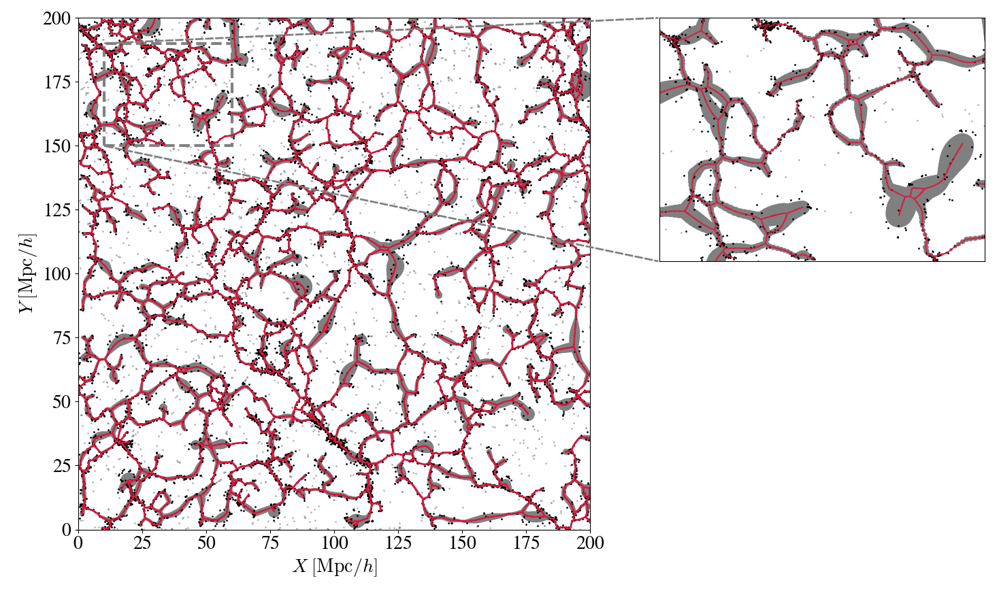

# T-ReX: a graph-based method for cosmic filament detection

[](https://www.gnu.org/licenses/gpl-3.0)

This git provides a python version of the T-ReX algorithm presented in two papers: 
- https://arxiv.org/abs/1912.00732 exposes the first version in the context of the identification of filaments in cosmological datasets,
- https://arxiv.org/abs/2106.09035 deepen the formalism and make it able to deal with noise, multiple scales and proposes a graph topology based on multiple minimum spanning trees.


## T-ReX

T-ReX (Tree-based Ridge eXtractor) allows to fit a prior topology provided by a graph structure and get a smooth regularised version of it. To do so, it uses a mixture model formalism in which the graph acts like a prior constraining the log-likelihood of the model. Initially developped for cosmological datasets and cosmic filaments detection, it can be applied to any kind of D-dimensional datasets from which one wants to extract a one-dimensional structure.




## Requirements

To run the code, you should be using Python 3.6 or higher and have the following packages installed:

- [Numpy](https://pypi.org/project/numpy/)

- [Scipy](https://www.scipy.org/install.html#pip-install)

- [Pandas](https://pypi.org/project/pandas/)

- [Scikit-learn](https://scikit-learn.org/stable/install.html)

- [python-igraph](https://igraph.org/python/)

- [h5py](https://pypi.org/project/h5py/)

- [Plotly](https://plot.ly/python/getting-started/)

- [Matplotlib](https://matplotlib.org/users/installing.html)

- [Seaborn](https://seaborn.pydata.org/installing.html)

- [tqdm](https://pypi.org/project/tqdm/)


All these packages can be installed easily using either conda or pip. Because igraph can sometimes cause troubles, I recommend installing it using the following command:

```
conda install -c conda-forge python-igraph
```
